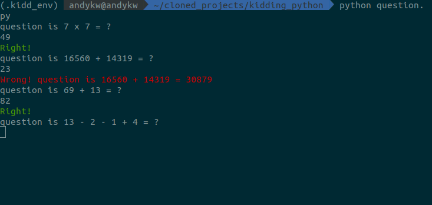

While learning Rust, [Canop](https://github.com/canop) showed me the program he did for his kids in Rust, 
that one, [Kidding](https://github.com/Canop/kidding).

As a quite simple program, I've decided to translate it into Python. The program is still ongoing as there 
are a few things that only exist in Rust and that needs adaptation in Python. Some part of it does not feel
pythonic enough for me and definitely needs changing.

It is asking questions like `35 + 12 = ?` in a loop.

The code is easy to tune and change with kid, it's a basis for a coding play too.

